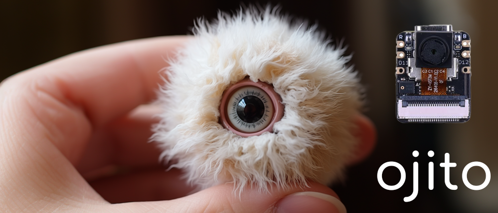
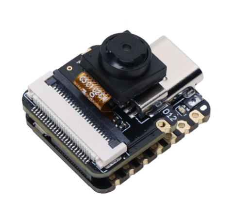

# ojito

Ojito (oh-hee-toh), a small eye to observe the world.

## Hardware

Ojito utilizes the [Seeed Studio XIAO ESP32S3 Sense](https://www.seeedstudio.com/XIAO-ESP32S3-Sense-p-5639.html). Other ESP32 products and cameras could also be used, but memory-restricted (no PSRAM) platforms will probably not work.



## Setup

- Create a [Replicate API token](https://replicate.com/account/api-tokens)

- Add your token and Wifi credentials to [include/secrets.h](include/secrets.h) 

```cpp
#define REPLICATE_TOKEN "yourtoken"
#define SSID "yourssid"
#define PASSWORD "yourpass"
```

- Update the host and model version ([example](https://replicate.com/tofighi/yolox/versions)) in [include/config.h](include/config.h) 

```cpp
// Do not add a / to the end of the URL path!
#define HOST "https://api.replicate.com/v1/predictions"
// #define HOST "http://10.0.0.31/predictions"
// Find your version at https://replicate.com/<user>/<model>/versions
#define MODEL_VERSION "0239647164ce56b643213501d63f6116a76a3c620e4194814968e8ba1aa64cb7"
```

- Update the serial port in [platformio.ini](platformio.ini):

```bash
upload_port = /dev/ttyACM0
monitor_port = /dev/ttyACM0
# Windows ports
# upload_port = COM1
# monitor_port = COM1 
# Mac ports (TBD)
# upload_port = /dev/ttyUSB
# monitor_port = /dev/ttyUSB
```

- Run the convenience script that installs dependencies, uploads the firmware, then monitors the serial output:

```bash
bash utils/Quickstart.sh
```

### Testing

***It is highly suggested that you test locally to save money during development!***

- Update the host (version not required locally) in [include/config.h](include/config.h) 

```cpp
// Do not add a / to the end of the URL path!
// #define HOST "https://api.replicate.com/v1/predictions"
#define HOST "http://<your-ip-address-here>/predictions"
```

- Run a test server locally with:

```bash
bash utils/TestServer.sh
```

### Further Reading

- [ESP32-S3 Sense](https://github.com/limengdu/SeeedStudio-XIAO-ESP32S3-Sense-camera/tree/main)
- [Cog](https://github.com/replicate/cog)
- [Base64](https://github.com/adamvr/arduino-base64)
- [ArduinoJson](https://github.com/bblanchon/ArduinoJson)
- [PlatformIO](https://github.com/platformio/platformio-core)

### Work to do

- [ ] Separate "input" schema from Core library

- [ ] Conditionally save images

- [ ] Web setup interface

- [ ] Find ideal resolution performance

- [ ] Add error handling for logner inference times

- [ ] Create tests
